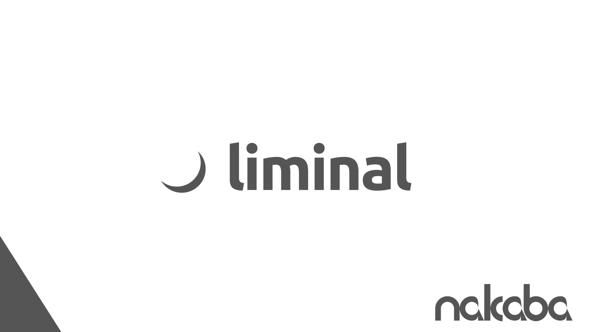

<div align="center">
    
    <p>
    汎用 React UI コンポーネントライブラリ<br>    
    ミニマムなコンポーネントを組み合わせることで、柔軟に UI を構築できます。
    </p>
</div>

---

# General

## Button

```tsx
<Button
  disabled={false}
  variant="filled"
  size="large"
  intention="primary"
  type="button"
  onClick={() => console.log("click")}
>
  Button
</Button>
```

### props

- disabled
  - boolean
- variant
  - "outlined" | "filled" | "text"
- size
  - "small" | "large"
- intention
  - "primary" | "secondary" | "shade" | "negative"
- type
  - "button" | "submit" | "reset"
- onClick
  - ClickEventHandler<HTMLButtonElement>
- children
  - ReactNode

> ボタン表示用コンポーネント。  
> `variant` によって見た目を切り替えることができます。  
> `disabled` が true の場合、操作できなくなります。

---

## Text

```tsx
<Text size="xl" weight="bold">
  Hello Component00
</Text>
```

### props

- size
  - "xs" | "s" | "r" | "xr" | "l" | "xl"
- weight
  - "normal" | "bold"
- children
  - ReactNode

> テキスト表示用コンポーネント。  
> `size` を変更することで文字サイズを調整できます。

---

# Form

## TextField

```tsx
const [name, setName] = useState("A");

<TextField
  label="ユーザー名"
  disabled={false}
  required={true}
  error={false}
  helperText="名前を入力してください"
  size="medium"
  value={name}
  onChange={(e) => setName(e.target.value)}
/>;
```

### props

- label
  - string
- disabled
  - boolean
- required
  - boolean
- error
  - boolean
- helperText
  - string
- size
  - "medium"
- value
  - string
- onChange
  - ChangeEventHandler<HTMLInputElement>

> テキスト入力用コンポーネント。  
> `value` と `onChange` を使用することで、React state によるフォーム制御 (Controlled Component) に対応します。

---

## TextArea

```tsx
const [comment, setComment] = useState("");

<TextArea
  label="コメント"
  disabled={false}
  required={true}
  error={false}
  helperText="内容を入力してください"
  size="medium"
  rows={5}
  value={comment}
  onChange={(e) => setComment(e.target.value)}
/>;
```

### props

- label
  - string
- disabled
  - boolean
- required
  - boolean
- error
  - boolean
- helperText
  - string
- size
  - "medium"
- rows
  - number
- value
  - string
- onChange
  - ChangeEventHandler<HTMLTextAreaElement>

> 複数行入力用コンポーネント。  
> `rows` を変更することで表示行数を調整できます。

---

## Checkbox

```tsx
const [checked, setChecked] = useState(false);

<Checkbox
  checked={checked}
  disabled={false}
  label="利用規約に同意"
  onChange={setChecked}
/>;
```

### props

- checked
  - boolean
- disabled
  - boolean
- label
  - string
- onChange
  - (checked: boolean) => void

> チェックボックス用コンポーネント。  
> `checked` と `onChange` を使用することで選択状態を制御できます。

---

## Radio

```tsx
const [value, setValue] = useState("A");

<Radio
  label="ひとつ選択してください"
  value={value}
  onChange={setValue}
  disabled={false}
  contents={[
    {
      label: "選択肢A",
      value: "A",
    },
    {
      label: "選択肢B",
      value: "B",
      checked: true,
    },
    {
      label: "選択肢C",
      value: "C",
    },
  ]}
/>;
```

### props

- label
  - string
- value
  - string
- onChange
  - (value: string) => void
- disabled
  - boolean
- contents
  - RadioObject[]

#### RadioObject

- label
  - string
- value
  - string
- checked
  - boolean

> ラジオボタン用コンポーネント。  
> `contents` に配列形式で選択肢を指定できます。  
> `value` と `onChange` を使用することで選択状態を制御できます。

---

## Switch

```tsx
const [enabled, setEnabled] = useState(false);

<Switch
  checked={enabled}
  onChange={setEnabled}
  disabled={false}
  label="メール通知を受け取る"
/>;
```

### props

- checked
  - boolean
- onChange
  - (checked: boolean) => void
- disabled
  - boolean
- label
  - string

> ON / OFF 状態を切り替えるためのコンポーネント。

---

## Select

```tsx
const [category, setCategory] = useState("music");

<Select
  label="カテゴリー"
  value={category}
  onChange={setCategory}
  disabled={false}
  options={[
    { label: "音楽", value: "music" },
    { label: "映像", value: "movie" },
    { label: "イラスト", value: "illust" },
  ]}
/>;
```

### props

- label
  - string
- value
  - string
- onChange
  - (value: string) => void
- disabled
  - boolean
- options
  - SelectOption[]

#### SelectOption

- label
  - string
- value
  - string

> 選択式入力用コンポーネント。  
> `options` に配列形式で選択肢を指定できます。  
> `value` と `onChange` を使用することで、React state による選択状態の制御 (Controlled Component) に対応します。  
> `disabled` が true の場合、操作できなくなります。

---

# Data Display

## Badge

```tsx
<Badge label="ライブ配信中" intention="primary" />
```

### props

- label
  - string
- intention
  - "primary" | "secondary" | "shade" | "negative" | "notice"

> ステータス表示用コンポーネント。

---

## Card

```tsx
<Card
  image="https://picsum.photos/500/500"
  title="カードタイトル"
  detail="ここに詳細情報"
  meta="2026-05-26"
/>
```

### props

- image
  - string
- title
  - string
- detail
  - string
- meta
  - string

> サムネイル付き情報表示コンポーネント。

---

# Layout

## Container

```tsx
<Container maxWidth={1200} fullWidth={false} padding={true}>
  {props.children}
</Container>
```

### props

- maxWidth
  - number
- fullWidth
  - boolean
- padding
  - boolean
- children
  - ReactNode

> コンテンツ横幅を制御するためのコンポーネント。

---

## CardContainer

```tsx
<CardContainer maxWidth={1200} fullWidth={false} padding={true}>
  <Card />
  <Card />
</CardContainer>
```

### props

- maxWidth
  - number
- fullWidth
  - boolean
- padding
  - boolean
- children
  - ReactNode

> Card を並べて表示するためのコンテナコンポーネント。  
> レスポンシブ対応のグリッドレイアウトを提供します。

---

## Spacer

```tsx
<Spacer size={50} />
```

### props

- size
  - number

> コンポーネント間に余白を作成できます。

---

## Header

```tsx
<Header
  maxWidth={1200}
  fixed={true}
  left={<Text>Logo</Text>}
  center={<Text>Center</Text>}
  right={<Button>Login</Button>}
/>
```

### props

- maxWidth
  - number
- fixed
  - boolean
- left
  - ReactNode
- center
  - ReactNode
- right
  - ReactNode

> ヘッダー表示用コンポーネント。  
> `fixed` が true の場合、画面上部へ固定表示されます。

---

# Feedback

## Modal

```tsx
const [open, setOpen] = useState(false);

<Button onClick={() => setOpen(true)}>
  開く
</Button>

<Modal open={open}>
  <h2>タイトル</h2>

  <Button onClick={() => setOpen(false)}>
    閉じる
  </Button>
</Modal>
```

### props

- open
  - boolean
- children
  - ReactNode

> モーダル表示用コンポーネント。  
> `open` が true の場合に表示されます。

---

## Menu

```tsx
<Menu>
  <Button>Home</Button>
  <Button>Search</Button>
</Menu>
```

### props

- children
  - ReactNode

> 展開式メニューコンポーネント。  
> 画面下部へ固定表示されます。

---

## Loading

```tsx
<Loading size={100} />
```

### props

- size
  - number

> ローディング表示用コンポーネント。

---

## Tabs

```tsx
<Tabs
  default="home"
  tabs={[
    {
      value: "home",
      label: "Home",
      component: <h3>Home</h3>,
    },
    {
      value: "about",
      label: "About",
      component: <h3>About</h3>,
    },
    {
      value: "work",
      label: "Work",
      component: <h3>Work</h3>,
    },
  ]}
/>
```

### props

- default
  - string
- tabs
  - TabObject[]

#### TabObject

- value
  - string
- label
  - string
- component
  - ReactNode

> タブ切り替え用コンポーネント。  
> `tabs` に配列形式でタブ情報を指定できます。  
> `component` に指定した ReactNode が、選択中タブの内容として表示されます。

---

## Upload

```tsx
const [thumbnail, setThumbnail] = useState({
  file: null,
  preview: "",
});

<Upload
  value={thumbnail}
  onChange={setThumbnail}
/>;
```

### props

- value
  - UploadValue
- onChange
  - (value: UploadValue) => void

#### UploadValue

- file
  - Blob | null
- preview
  - string

> 画像アップロード用コンポーネント。  
> jpg / png 形式の画像をアップロードできます。  
> ドラッグ＆ドロップ、またはクリックによるファイル選択に対応しています。  
> アップロード後は画像編集画面が表示され、16:9 の比率でトリミングできます。  
> 完了時に 1280×720 のサムネイル画像が生成されます。  
> `value` と `onChange` を使用することで、React state による画像データの制御 (Controlled Component) に対応します。
